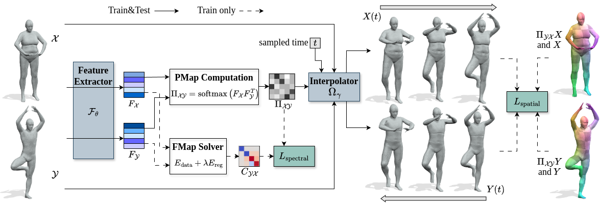

## [Spectral Meets Spatial: Harmonising 3D Shape Matching and Interpolation](https://arxiv.org/abs/2402.18920)


## Installation
```bash 
conda create -n sms python=3.9 # create new viertual environment
conda activate sms
conda install pytorch=1.13.0 torchvision pytorch-cuda=11.6 -c pytorch -c nvidia # install pytorch
conda install -c fvcore -c iopath -c conda-forge fvcore iopath
conda install pytorch3d -c pytorch3d # install pytorch3d
conda install pyg -c pyg # install torch_geometric
pip install -r requirements.txt # install other necessary libraries via pip
```

## Dataset
To train and test datasets used in this paper, please download the datasets from the this [link](https://drive.google.com/file/d/1RmFxmQlwfNMLwxIUvbDp8xI80fARg1dN/view) and put all datasets under ../data/
```Shell
├── data
    ├── FAUST_aligned
```
We thank the original dataset providers for their contributions to the shape analysis community, and that all credits should go to the original authors.

## Data preparation
For data preprocessing, we provide *[preprocess.py](preprocess.py)* to compute all things we need.
Here is an example for FAUST_r.
```python
python preprocess.py --data_root ../data/FAUST_aligned/ --no_normalize --n_eig 300
```

## Train
To train the model on a specified dataset.
```python
python train.py --opt options/train/faust.yaml 
```
You can visualize the training process in tensorboard.
```bash
tensorboard --logdir experiments/
```

## Test
To test the model on a specified dataset.
```python
python test.py --opt options/test/faust.yaml 
```
The qualitative and quantitative results will be saved in [results](results) folder.

## Shape interpolation
To perform shape interpolation on a specified dataset.
```python
python shape_interpolation.py
```
The results will be saved in [results](results) folder.

## Acknowledgement
The implementation of DiffusionNet is based on [the official implementation](https://github.com/nmwsharp/diffusion-net).

The framework implementation is adapted from [Unsupervised Deep Multi Shape Matching](https://github.com/dongliangcao/Unsupervised-Deep-Multi-Shape-Matching).
